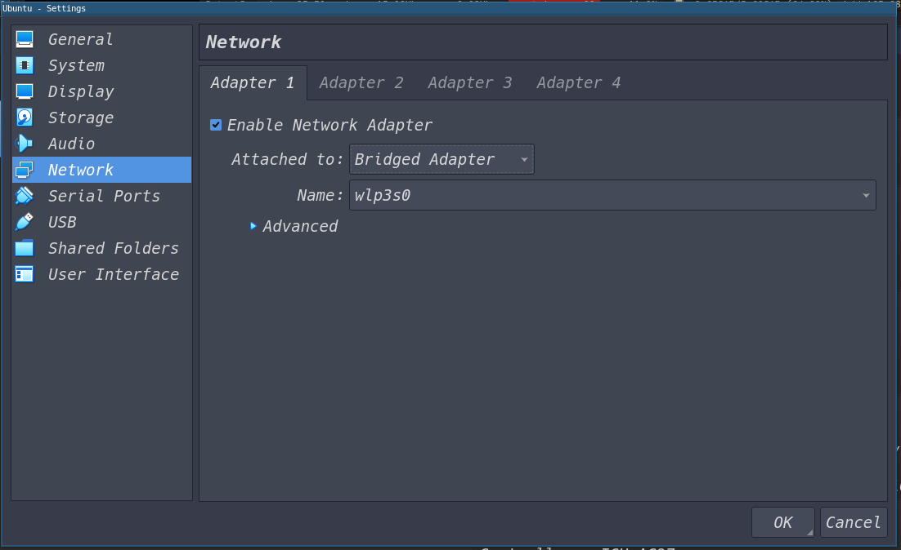
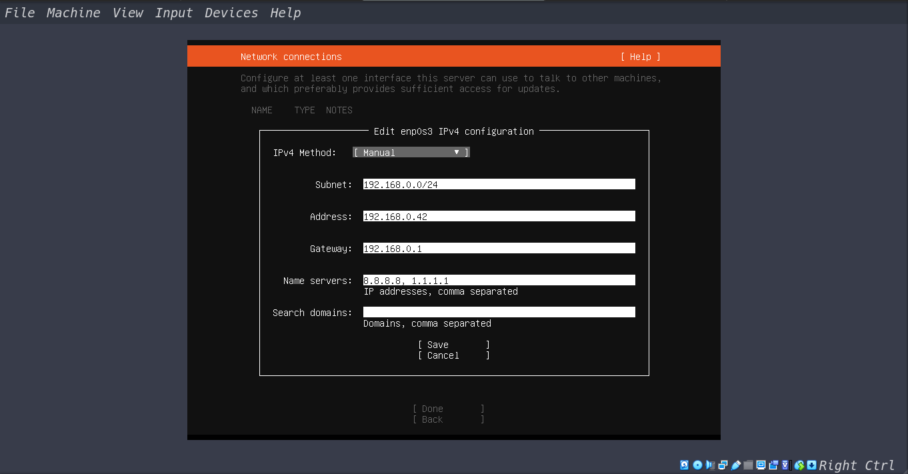

### Configurando Modo Bridge para interface de rede wireless

### Configurando IP Estático Manualmente:

OBS:
Instale o openssh-server, 

acesse a máquina via: ssh usuario@meuip

Clone o repositório: https://github.com/herculan0/prova-devops

Entre na pasta: cd prova-devops

Execute o script: ./instalar.sh

Digite sua senha

Assim que o script finalizar, basta acessar o http://meuip/perguntas

#Comandos
#### Adicionando grupo e usuário

sudo groupadd www-group

sudo useradd -m -s /bin/bash -g www-data www-prova

#### Instalação dos Aplicativos

sudo apt update && sudo apt install -y openssh-server apache2 php libapache2-mod-php && sudo apt clean

#### Adicionar Permissão ao Firewall para o Servidor Web Apache

sudo ufw allow "Apache Full"

#### Módulos Apache

sudo a2dismod mpm_event && a2enmod mpm_prefork &&  a2enmod php7.2

#### Reiniciar Apache

sudo systemctl restart apache2

#### Criar novo link do site disponível para o site ativo

sudo mv /etc/apache2/sites-enabled/000-default.conf /etc/apache2/sites-enabled/bkp-default.conf

sudo ln -s /etc/apache2/sites-available/000-default.conf /etc/apache2/sites-enabled/000-default.conf

#### Monitoramento do Servidor Web Apache

Monitoramento de acesso

tail -f /var/log/httpd/access_log

Monitoramento de erros

tail -f /var/log/httpd/error_log

#### Identificação do Parâmetro em questão
cat index.php

#### Versões instaladas

Ubuntu 18.04

PHP: 7.2.24

Apache: 2.4.29

### Manuais de comandos, Documentações, e Referências utilizadas

man sshd

man php

man apache2

man nslookup

https://ubuntu.com/server/docs/web-servers-apache

http://httpd.apache.org/docs/2.4/

https://www.php.net/manual/pt_BR/install.unix.debian.php

https://stackoverflow.com/questions/12142172/apache-shows-php-code-instead-of-executing-it#12142315
